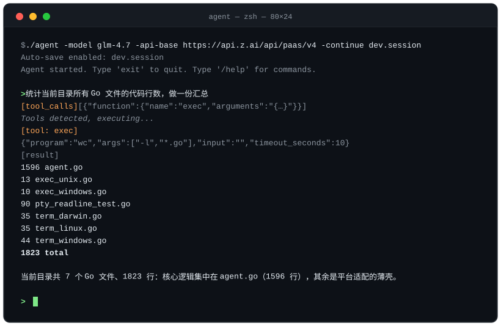

<div align="center">

# ⚡ agent-go

**一个单二进制、零依赖的终端 AI Agent —— ~1600 行纯 Go（标准库）**

流式输出 · 工具调用 · 多模态 · 会话持久化 · 跨平台

[](#-快速开始)
[](#-快速开始)
[](#-特性)
[](#-测试与质量)
[](#-许可)
[](#-designed-by-deepseek--glm)
[](https://github.com/dksslq/agent-go/actions/workflows/ci.yml)



</div>

---

## ✨ 特性

| | |
|---|---|
| 🪶 **轻到极致** | 核心逻辑单文件 `agent.go`（~1600 行），**只用 Go 标准库、零第三方依赖、无 cgo**，交叉编译产出单文件二进制 |
| 🌊 **真流式** | SSE 逐 token 输出；`-reasoning-field` 等 4 个 delta 字段名可映射，**原生兼容 DeepSeek-R1 等推理模型**，思考流与正文分流呈现 |
| 🔧 **工具调用** | `exec`（stdin 注入 / 超时 / 后台 detach / cwd / 环境注入 / 输出限长）、`image_read`、`video_read`；**同轮多工具并行执行** |
| 🖼 **多模态** | `/image` `/image-url` `/video` `/video-url` 附件随下一条消息发送——让模型"看得见图、看得了视频" |
| 💾 **会话持久化** | `-save` / `-load` / `-continue` 一键续聊，`/save` `/reload` 在线切换；每轮结束自动存档，对话历史永不丢 |
| ⌨️ **终端原生** | raw mode 行内编辑（退格即见即所得）；**Ctrl+C 中断当前推理轮、再按退出**；转义序列安全吞除——方向键 / Home / Delete 不会污染输入（有 PTY 实测背书） |
| 🛡 **防御性默认** | `-max-tool-rounds` 工具轮次护栏（默认 25，对齐 OpenAI Agents SDK / LangChain 惯例）、工具流空闲超时、媒体体积上限、panic 恢复并自动还原终端状态 |
| 🔌 **即插即用** | 直连任何 **OpenAI 兼容 API**（GLM / DeepSeek / OpenAI / vLLM / Ollama…）；`-extra` 以 Base64 注入任意 JSON 请求字段，厂商私有参数全兼容 |

## 🚀 快速开始

**安装**

| 方式 | 说明 |
|---|---|
| Go | `go install github.com/dksslq/agent-go@latest`（Go 1.21+，秒级构建） |
| Debian / Ubuntu | Release 页下载 `.deb` → `apt install ./agent-go_*_amd64.deb`；`debian/` 打包已就绪（dh-golang 规范、CI 持续验证），经 ITP + 赞助人提交后进入官方仓库并自动同步 Ubuntu |
| 源码 | `git clone` → `go build -o agent .` |

**运行**

```bash
# 交互模式（-continue 自动续档 + 存档）
./agent -model glm-4.7 \
        -api-base https://api.z.ai/api/paas/v4 \
        -api-key  "$ZAI_API_KEY" \
        -continue dev.session

# 一次性提问（脚本友好）
./agent -model glm-4.7 -api-base https://api.z.ai/api/paas/v4 \
        -api-key "$ZAI_API_KEY" \
        -prompt "用一句话介绍你自己" -once
```

## ⌨️ 交互命令与按键

| 命令 | 作用 |
|---|---|
| `/image <path>` / `/image-url <url>` | 追加图片到下一条消息 |
| `/video <path>` / `/video-url <url>` | 追加视频到下一条消息 |
| `/pending` · `/clear` | 查看 / 清空待发媒体 |
| `/save <file>` · `/reload <file>` | 保存 / 重载会话 |
| `exit` · `quit` · `Ctrl+D` | 结束会话 |

| 按键 | 行为 |
|---|---|
| `Ctrl+C`（推理中） | 中断当前轮，已生成内容与 tool_calls 成对入档 |
| `Ctrl+C`（空闲时） | 退出（退出码 130） |
| `Backspace` | 删除上一个字符（raw mode 实时回显） |
| 方向键 / Home / End / Delete | 安全吞除，不污染输入 ✅ |

## 🧰 内置工具

| 工具 | 能力 |
|---|---|
| `exec` | 启动任意程序并向 **stdin 写入字符串**；必填 `timeout_seconds`；支持 `cwd`、`environ`、`max_output_chars` 截断、`detach` 后台运行、`unquote_arguments` / `quote_result` 转义控制 |
| `image_read` | 读取本地图片 → base64 data URI，模型直接"看图" |
| `video_read` | 读取本地视频 → base64 data URI，模型直接"看片" |

## ⚙️ 参数一览

| 参数 | 默认 | 说明 |
|---|---|---|
| `-model` | （必填） | 模型名 |
| `-api-base` | `http://localhost:8080/v1` | OpenAI 兼容 API 地址 |
| `-api-key` | 空 | API Key |
| `-prompt` / `-once` | — | 非交互单问；`-once` 处理完即退 |
| `-load` / `-save` / `-continue` | — | 启动载入 / 逐轮自动存档 / 续聊（同一文件自动双向） |
| `-reasoning-field` `-content-field` `-tool-calls-field` `-finish-reason-field` | `reasoning_content` 等 | 流式 delta 字段名映射，适配不同厂商 |
| `-max-tool-rounds` | `25` | 每轮用户输入的工具循环上限（`0` 不限；对齐主流 Agent 框架惯例） |
| `-max-file-bytes` | `0` | 媒体文件大小上限 |
| `-max-exec-output-chars` | `0` | exec 输出默认截断 |
| `-tool-call-idle-timeout` | `5m` | 工具参数流空闲超时（防模型断流挂死） |
| `-extra` | 可重复 | Base64(JSON) 合并进请求体，私有参数全兼容 |

## 🔒 安全与审计

两条硬约束**可 grep 复核**：

- **网络**：程序自身仅 `chatStream` 访问模型 API（`apiBase + "/chat/completions"`），无任何其他网络请求；
- **文件**：仅 `readMedia`（工具用）与 `saveSession` / `loadSession`（会话存档）读写文件，无其他 IO。

```bash
rg -n 'http\.' agent.go      # 网络面：只有 chatStream
rg -n 'os\.(Open|Create)' agent.go   # 文件面：只有媒体与会话
```

## 🧪 测试与质量

全部测试仅用标准库 `testing` + `httptest`，**零测试依赖**，`go test .` 一条命令全跑：

| 套件 | 用例 | 覆盖 | 平台 |
|---|---|---|---|
| `agent_test.go` | 16 函数 / 31 用例 | 会话存档 round-trip（多模态 / tool_calls / tool 成对）；空、坏、缺文件；**system ENV 载入即刷新**（PID/时间戳/环境变量更新为当前进程，规则段与自定义 system 原样保留）；提示词结构；转义序列吞除（管道模式）；控制字符；媒体读取（类型 / 大小 / 目录）；工具辅助（wrapResult / 参数解析）；sanitize；ANSI 剥离 | 全平台 |
| `sse_test.go` | 13 函数 | SSE 全链路（httptest 假端点）：reasoning / content 分流；tool_calls 乱序分片累积、finish 触发与 EOF 兜底、`[DONE]` 停读；自定义字段映射；坏行跳过；API 错误；断连；ctx 取消；请求形状（model / tools / auth / `-extra` 合并）；**工具轮次护栏端到端**（assistant 与 tool 消息严格成对） | 全平台 |
| `pty_readline_test.go` | 3 用例 | 真实 `/dev/ptmx` 伪终端 + raw mode 驱动真实 `readLine`：方向键 / Home / Delete 不污染输入、纯文本、退格编辑 | linux |

平台差异几乎只有终端特性：输入解析、流解析、会话、工具辅助均在纯管道层验证（全平台），仅终端行编辑需 PTY 实测（linux）。

历史改动详见 [CHANGES.md](CHANGES.md)，最小修复补丁见 [agent-fix.patch](agent-fix.patch)。

## 📦 目录结构

```
agent-go
├── agent.go               # 核心逻辑（~1600 行）：流式推理、工具循环、会话、raw mode 输入
├── term_linux.go          # 平台适配：raw mode（Linux/macOS/Windows 各一）
├── term_darwin.go
├── term_windows.go
├── exec_unix.go           # 平台适配：进程组（Unix）/ Windows 空实现
├── exec_windows.go
├── agent_test.go          # 全平台单测：会话 / 提示词刷新 / 输入 / 媒体 / 工具辅助
├── sse_test.go            # 全平台单测：SSE 全链路（httptest）/ 轮次护栏端到端
├── pty_readline_test.go   # PTY 输入回归实测（linux only）
├── go.mod
├── debian/                # Debian 打包（dh-golang）：control / rules / changelog / copyright
├── docs/demo.svg          # 效果演示
├── CHANGES.md             # 修复说明
├── .github/workflows/ci.yml       # CI：vet + build + PTY test + 6 平台交叉编译 + .deb 打包（lintian）
└── .github/workflows/release.yml  # tag v* → 6 平台二进制 + .deb 自动挂 Release
```

## 🚢 发布到 GitHub

```bash
cd agent-go
git init -b main
git add .
git commit -m "feat: agent-go — 单二进制终端 AI Agent（designed by DeepSeek × GLM）"
git remote add origin git@github.com:<your-username>/agent-go.git
git push -u origin main
```

CI 徽章已指向 `dksslq/agent-go`，fork 后把 README 顶部的仓库名改为你自己的即可。

## 🧬 Designed by DeepSeek × GLM

<div align="center">

**本程序由 [DeepSeek](https://www.deepseek.com/) 与 [GLM (Z.ai)](https://z.ai/) 联合设计。**

一个由 AI 为 AI 写的终端 Agent —— 架构与代码出自 **ds × glm** 双模型协作，
评审、实测修复（编译矩阵 / PTY 复现回归）与本主页亦然。

*Less code, more agent.*

</div>

## 📄 许可

[MIT](LICENSE) © DeepSeek × GLM (Z.ai)
